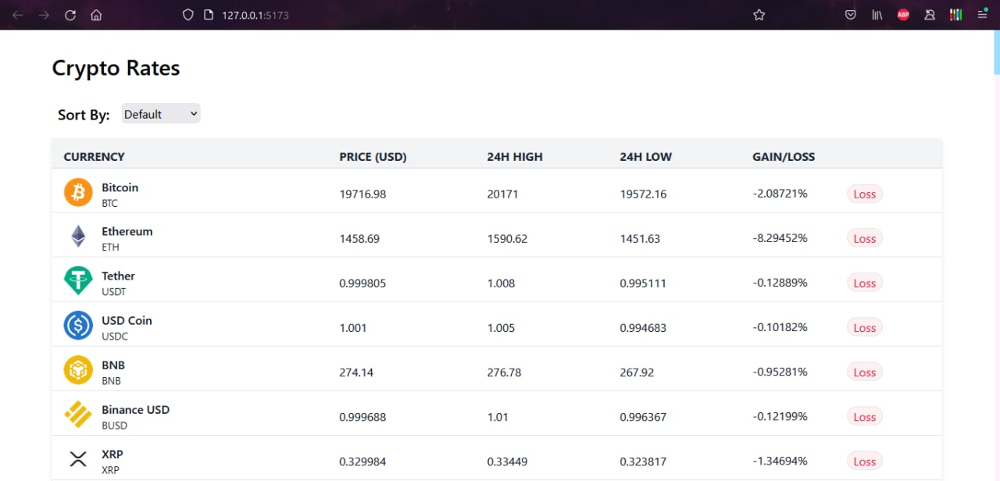

# Crypto Rates



## Setup

First, clone the project.

Once in the root of the folder, install dependecies and start the server.

The repository uses [Vite](https://vitejs.dev/) as the build tool.

```
npm i
npm run dev
```

## Project Description

This site pulls data from our own serverless cloud function hosted on GCP.

The function pulls data from this [API](https://api.coingecko.com/api/v3/coins/markets?vs_currency=usd).

It then sorts the data based on different metrics and returns it to our frontend as JSON.

Users can sort based on certain filters
and site content will dynamically update.

## Project Stack

This project is built with GCP, TypeScript, React, TailwindCSS and Vite.

## Resources

Resources to learn Tailwind and inspiration: [link](https://www.youtube.com/watch?v=3TEiC8F8I5g)